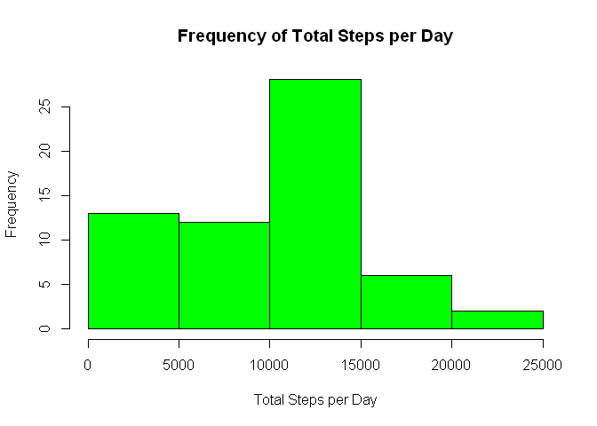
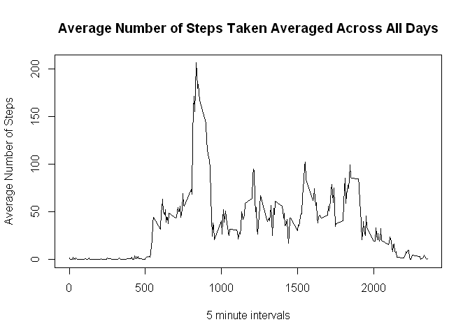
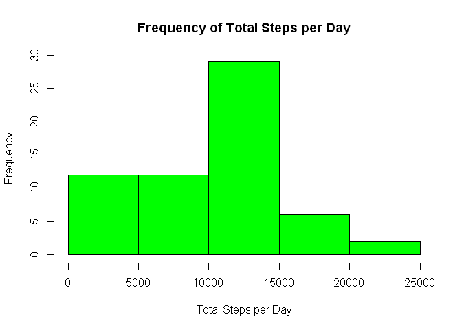
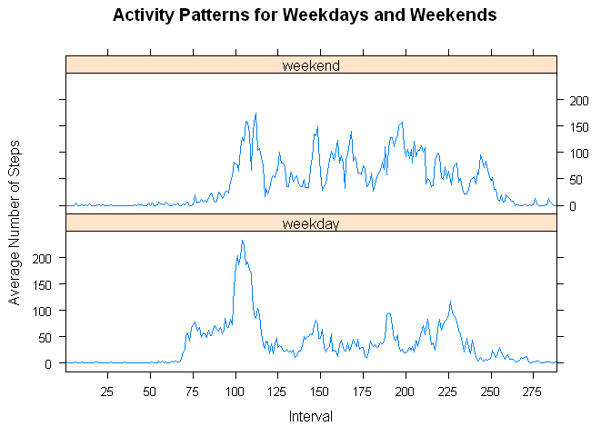

# Reproducible Research: Peer Assessment 1


## Loading and preprocessing the data

```r
data<-read.csv("activity.csv")
```


## What is mean total number of steps taken per day?

```r
y<-tapply(data$steps, data$date, FUN=sum,na.rm=TRUE)
hist(y,main="Frequency of Total Steps per Day",xlab="Total Steps per Day",col="green")
```

 

```r
mean_steps<-mean(y)
median_steps<-median(y)
```
### The mean number of steps taken per day:

```r
mean_steps
```

```
## [1] 9354.23
```
### The median number of steps taken per day:

```r
median_steps
```

```
## [1] 10395
```
## What is the average daily activity pattern?

```r
z<-tapply(data$steps,data$interval, FUN=mean, na.rm=TRUE)
 intervals<-unique(data$interval)

plot(intervals,z, type="l",main="Average Number of Steps Taken Averaged Across All Days",xlab="5 minute intervals",ylab="Average Number of Steps") 
```

 

```r
g<-which.max(z)
```
###Which 5-minute interval, on average across all the days in the dataset,contains the maximum number of steps?

```r
g
```

```
## 835 
## 104
```
### Interval 835 contains the maximum number of steps.

## Imputing missing values
### The total number of missing values in the dataset.


```r
nrows<-sum(!complete.cases(data))
nrows
```

```
## [1] 2304
```
### The NA values are replaced with the mean number of steps for that interval.


```r
library(plyr)
```

```
## Warning: package 'plyr' was built under R version 3.1.3
```

```r
df<-ddply(data, "interval", summarise, mean = mean(steps,na.rm=TRUE))
y <- which(is.na(data$steps)==TRUE) 

for (i in 1:length(y) ) 
  {
    data$steps[y]<-df$mean[y]
  }
y<-tapply(data$steps, data$date, FUN=sum,na.rm=TRUE)
hist(y,main="Frequency of Total Steps per Day",xlab="Total Steps per Day",col="green")
```

 

```r
mean_steps<-mean(y)
median_steps<-median(y)
```
### The mean number of steps taken per day:

```r
mean_steps
```

```
## [1] 9530.724
```
### The median number of steps taken per day:

```r
median_steps
```

```
## [1] 10439
```
###Do these values differ from the estimates from the first part of the assignment? Yes the mean and median values are higher when the NAs are substituted with the mean values for the missing intervals.
###What is the impact of imputing missing data on the estimates of the total daily number of steps? The histogram looks a bit diferent since the frequency of the total steps per day has changed.  Since there is not a lot of missing data, the histograms still look similar and the mean and median values are close to the mean and median values calculated with the original dataset.
## Are there differences in activity patterns between weekdays and weekends? A new variable day is added to the data dataset which specifies whether the day in question was a weekday or a weekend.

```r
day <- weekdays(as.Date(data$date))
day<-gsub("Monday","weekday",day)
day<-gsub("Tuesday","weekday",day)
day<-gsub("Wednesday","weekday",day)
day<-gsub("Thursday","weekday",day)
day<-gsub("Friday","weekday",day)
day<-gsub("Saturday","weekend",day)
day<-gsub("Sunday","weekend",day)
data$day<-day
cdata<-ddply(data, c("day","interval"),summarize, mean_steps=mean(steps, na.rm=TRUE))
library(lattice)
at<-seq(from=0,to=2355, by=25)
gg<-transform(cdata,interval=factor(interval))
xyplot(mean_steps~interval|day,data=gg,main="Activity Patterns for Weekdays and Weekends",xlab="Interval",ylab="Average Number of Steps",type="l",layout=c(1,2),scales=list(x=list(at=at,labels=at)))
```

 
